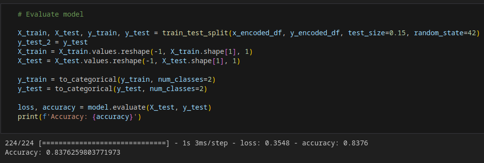
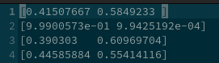
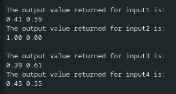

## IoT Project - Based on given features, predict if salary is >50k or <= 50k

### Results 
**Accuracy** = 83%  

<table>
  <tr>
    <td>
      <strong>Model Accuracy</strong> 
      
    </td>
    <td>
      <strong>Comparisons between Actual and Predicted</strong> 
      <table>
        <tr>
          <th>Predicted</th>
          <th>Actual</th>
        </tr>
        <tr>
          <td>1</td>
          <td>0</td>
        </tr>
        <tr>
          <td>0</td>
          <td>0</td>
        </tr>
        <tr>
          <td>1</td>
          <td>0</td>
        </tr>
        <tr>
          <td>1</td>
          <td>1</td>
        </tr>
        <tr>
          <td>1</td>
          <td>1</td>
        </tr>
        <tr>
          <td>0</td>
          <td>0</td>
        </tr>
        <tr>
          <td>0</td>
          <td>0</td>
        </tr>
        <tr>
          <td>0</td>
          <td>0</td>
        </tr>
        <tr>
          <td>1</td>
          <td>1</td>
        </tr>
        <tr>
          <td>1</td>
          <td>1</td>
        </tr>
      </table>
       <strong>First 4 Features Given to Python Model</strong>
    </td>
  </tr>
</table>

### First 4 features from above table given to python model 

| **Python Model Output**                          | **ESP32 Output**                               |
|-------------------------------------------------|------------------------------------------------|
|       |            |

